# 🏗️ Taskify — Full Architecture Diagrams

All diagrams are based on the **current** codebase as of May 14, 2026.

---

## 1. Backend Request/Response Flowchart

> How does a single HTTP request flow through the Express backend?

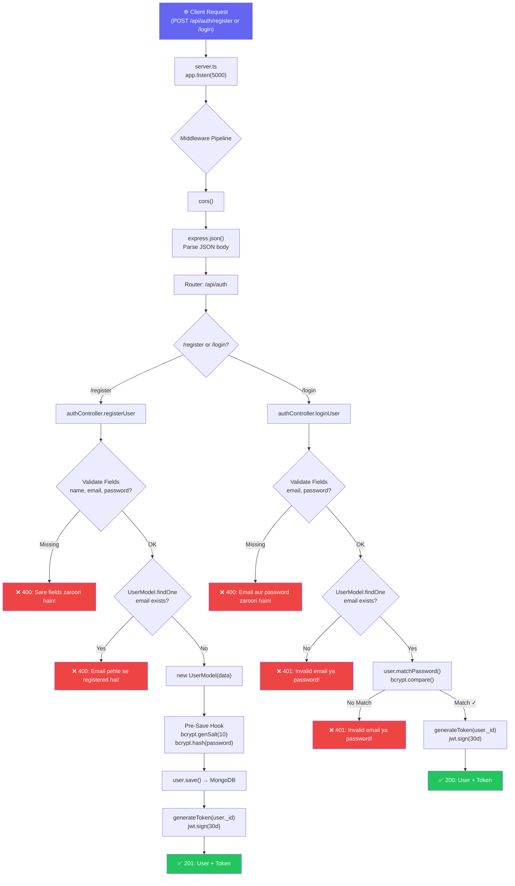

---

## 2. Full-Stack Sequence Diagram (Frontend ↔ Backend ↔ DB)

> What happens when a user clicks "Sign Up" or "Sign In" end to end?

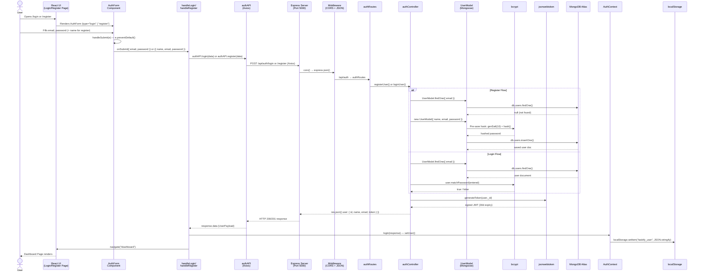

---

## 3. ER Diagram — MongoDB Schema

> Current database structure (User collection only at this stage)

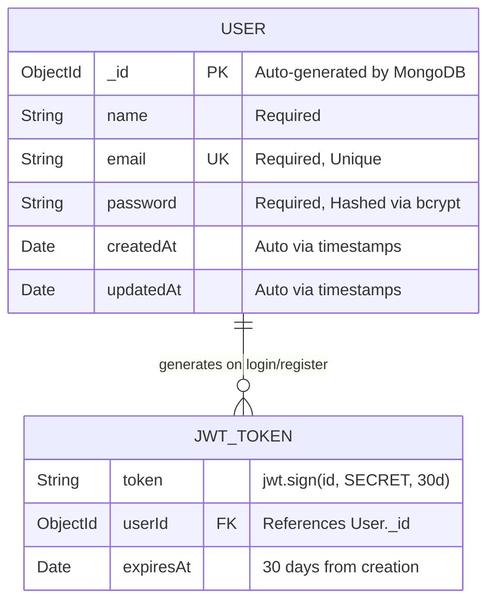

> [!NOTE]
> JWT tokens are **not stored in MongoDB**. They are stateless — generated on the fly and sent to the client. The `JWT_TOKEN` entity above represents the logical relationship, not a physical collection.

### User Model Methods & Hooks

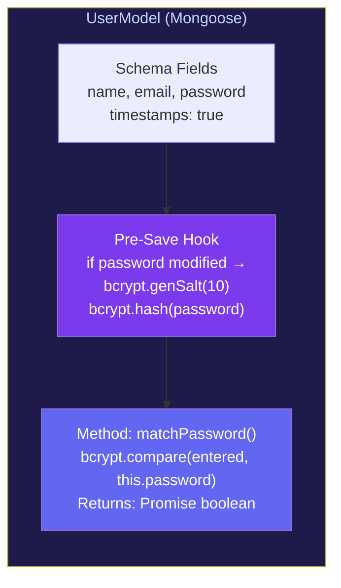

---

## 4. React UI State Diagram

> All possible states and transitions in the frontend app

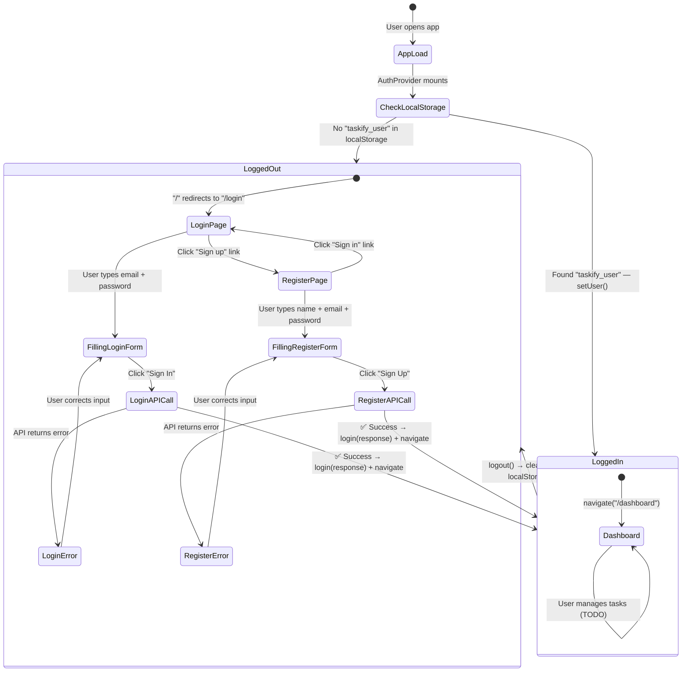

---

## 📁 File Map — Quick Reference

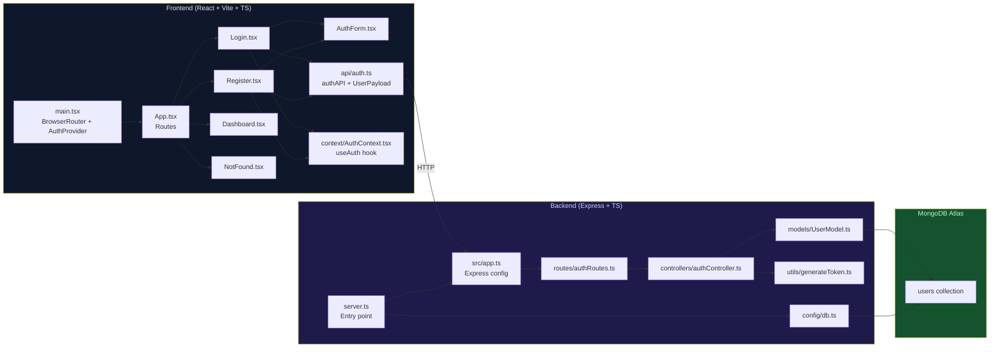

---

---

# 🚀 Feature 2: Task CRUD — Implementation Roadmap

> **Status**: Phase Planning (May 15, 2026)
> **Goal**: Extend the application from Auth-only to full Task Management (Create, Read, Update, Delete)

---

## 5. Feature 2 — Build Order & File Structure

> Which files do you need to create, in what order, and where?

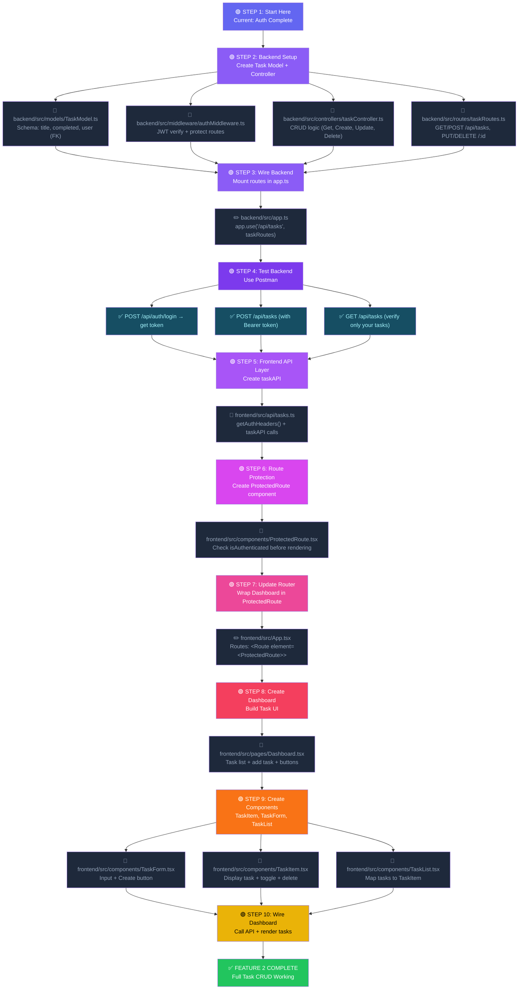

---

## 6. Backend Task Flow — Auth Middleware → Task CRUD → DB

> How does a **Task API request** flow through the backend with protection?

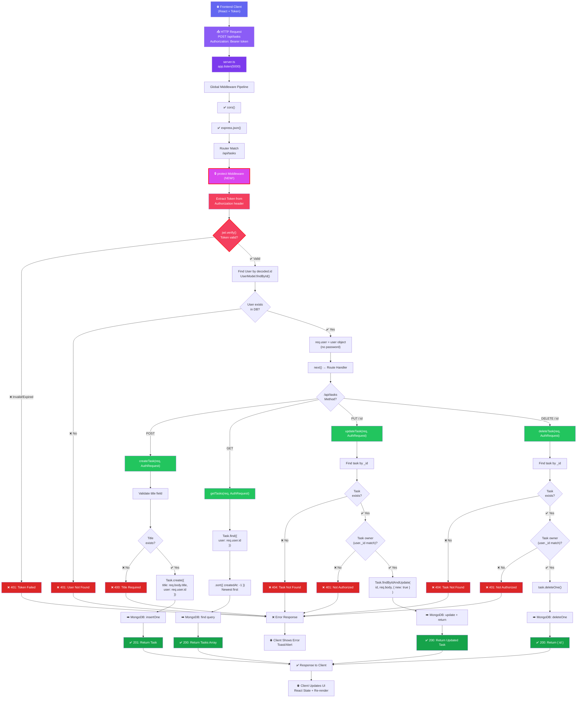

---

## 7. MongoDB Schema Extension — User + Task Relationship

> From Auth-only to Tasks, here's the new schema with relationships

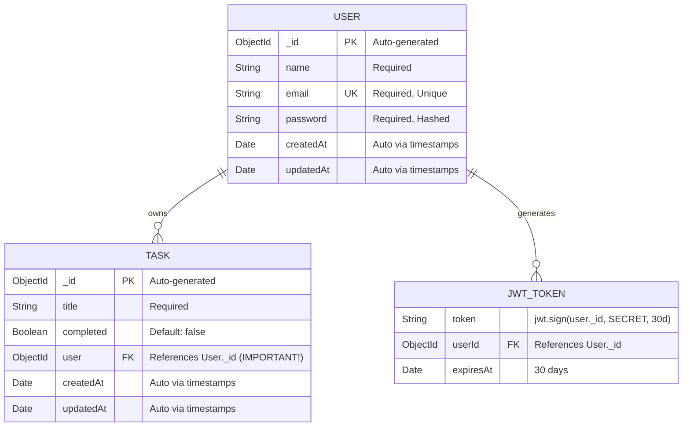

> [!IMPORTANT]
> **User Isolation**: The `user` field in TASK schema ensures each task belongs to exactly ONE user. This is critical for data privacy — a user can ONLY see/edit/delete their own tasks.

---

## 8. Frontend Task Management Flow — Create → Update → Delete

> What happens when a user creates/updates/deletes a task on the Dashboard?

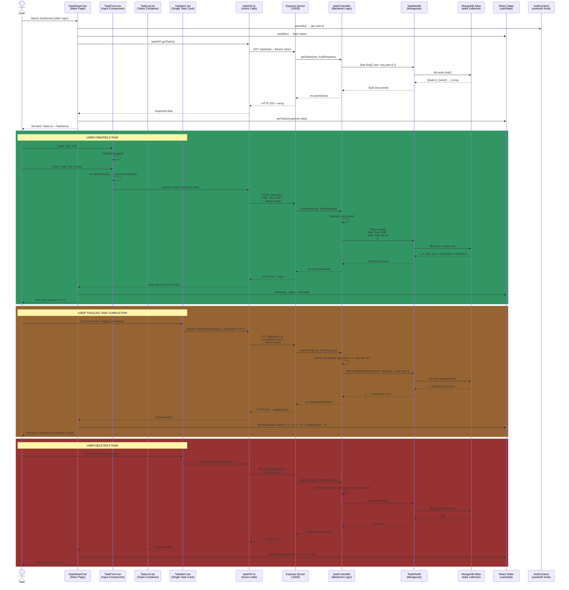

---

## 9. File-by-File Implementation Guide

### 🔧 Backend Files (In Order)

#### **File 1: `backend/src/middleware/authMiddleware.ts`** 
> Route protection — verify JWT and attach user to request

**What goes here:**
- Import `jwt`, `Request`, `Response`, `NextFunction` from express
- Extend Express `Request` type to add optional `user` property
- Create `protect` middleware function that:
  - Extracts token from `Authorization: Bearer <token>`
  - Verifies JWT using `jwt.verify()`
  - Finds user in database without password
  - Attaches user to `req.user`
  - Calls `next()` if valid, returns 401 if invalid

**Dependencies needed:**
```json
{
  "jsonwebtoken": "^9.x",
  "mongoose": "^7.x"
}
```

---

#### **File 2: `backend/src/models/TaskModel.ts`**
> Mongoose schema for tasks

**What goes here:**
- Create TypeScript interface `ITask` extending Mongoose `Document`
- Define schema fields: `title` (String, required), `completed` (Boolean, default false), `user` (ObjectId, FK to User)
- Add `timestamps: true` for auto `createdAt`/`updatedAt`
- Export model as default

**Key relationships:**
```
Task.user → User._id (One Task belongs to One User)
```

---

#### **File 3: `backend/src/controllers/taskController.ts`**
> CRUD operations for tasks

**What goes here:**
- `getTasks()` — Find all tasks where `user === req.user.id`, sort by `-createdAt`
- `createTask()` — Validate title, create new task with `user: req.user.id`
- `updateTask()` — Find task, verify ownership, update with new data
- `deleteTask()` — Find task, verify ownership, delete

**Important:** All functions check `task.user.toString() === req.user.id` to ensure ownership

---

#### **File 4: `backend/src/routes/taskRoutes.ts`**
> Express router for task endpoints

**What goes here:**
- Create Express router
- Add `router.use(protect)` to protect ALL routes
- `router.route('/').get(getTasks).post(createTask)`
- `router.route('/:id').put(updateTask).delete(deleteTask)`
- Export router

**Mounted as:** `app.use('/api/tasks', taskRoutes)` in `app.ts`

---

#### **File 5: Update `backend/src/app.ts`** *(Edit existing)*
> Mount the new task routes

**Add this line:**
```typescript
import taskRoutes from './routes/taskRoutes';

// After authRoutes line:
app.use('/api/tasks', taskRoutes);
```

---

### 🎨 Frontend Files (In Order)

#### **File 6: `frontend/src/api/tasks.ts`** *(New)*
> API layer for task operations

**What goes here:**
- `getAuthHeaders()` function — Extract token from localStorage, return headers with `Authorization: Bearer <token>`
- `Task` interface with fields: `_id`, `title`, `completed`, `createdAt`
- `taskAPI` object with methods:
  - `getTasks()` — GET /api/tasks
  - `createTask(title)` — POST /api/tasks
  - `updateTask(id, data)` — PUT /api/tasks/:id
  - `deleteTask(id)` — DELETE /api/tasks/:id

---

#### **File 7: `frontend/src/components/ProtectedRoute.tsx`** *(New)*
> Guard dashboard from unauthenticated users

**What goes here:**
- Import `useAuth` from context
- Check `isAuthenticated` from auth context
- If false: return `<Navigate to="/login" />`
- If true: return `<Outlet />` (render child routes)

---

#### **File 8: Update `frontend/src/App.tsx`** *(Edit existing)*
> Wrap Dashboard in ProtectedRoute

**Change this:**
```tsx
// Before:
<Route path="/dashboard" element={<Dashboard />} />

// After:
<Route element={<ProtectedRoute />}>
  <Route path="/dashboard" element={<Dashboard />} />
</Route>
```

---

#### **File 9: `frontend/src/pages/Dashboard.tsx`** *(New)*
> Main task management page

**What goes here:**
- `useEffect` hook to fetch tasks on mount
- State: `tasks`, `loading`, `error`
- State: `newTaskTitle` for input field
- Call `taskAPI.getTasks()` and `setTasks()`
- Render: `TaskForm` for creating tasks
- Render: `TaskList` passing `tasks` and callbacks
- Callbacks: `handleDeleteTask()`, `handleToggleTask()`

---

#### **File 10: `frontend/src/components/TaskForm.tsx`** *(New)*
> Input form for creating new tasks

**What goes here:**
- `input` field for task title
- State: `title`
- `handleChange()` to update state
- `handleSubmit()` that calls `onSubmit(title)` prop
- Clear input after submit
- Handle loading/error states

---

#### **File 11: `frontend/src/components/TaskItem.tsx`** *(New)*
> Single task card with checkbox and delete button

**What goes here:**
- Display `task.title`
- Checkbox for `task.completed`, trigger `onToggle(task._id)`
- Delete button, trigger `onDelete(task._id)`
- Styling: Strike-through text if `completed === true`
- Show `createdAt` date (optional)

---

#### **File 12: `frontend/src/components/TaskList.tsx`** *(New)*
> Container for rendering all tasks

**What goes here:**
- Map `tasks` array to `<TaskItem />` components
- Pass callbacks: `onToggle`, `onDelete`
- Show loading state if `loading === true`
- Show empty state if `tasks.length === 0`
- Show error message if `error` exists

---

## 10. Data Flow Diagram — Full Stack Task Creation

> Complete end-to-end journey of creating a task: UI → API → DB → UI

```mermaid
graph LR
    subgraph User["👤 User"]
        UserAction["Types 'Buy groceries'<br/>Clicks 'Add Task'"]
    end

    subgraph Frontend["🎨 Frontend (React)"]
        TF["TaskForm.tsx<br/>handleSubmit()"]
        State["useState(tasks)"]
        TL["TaskList.tsx<br/>map → TaskItem"]
        API["api/tasks.ts<br/>createTask(title)"]
    end

    subgraph Backend["⚙️ Backend (Express)"]
        Route["POST /api/tasks<br/>router"]
        Protect["protect<br/>middleware<br/>verify JWT"]
        Ctrl["taskController<br/>createTask()"]
        Valid["Validate<br/>title exists"]
        Create["Task.create({<br/>title,<br/>user: req.user.id<br/>})"]
    end

    subgraph Database["💾 Database (MongoDB)"]
        Insert["insertOne()<br/>new task doc"]
    end

    subgraph Response["📤 Response"]
        ResCtrl["Return 201<br/>+ new task"]
        ResAPI["Response.data<br/>task object"]
        ResState["setTasks([...old, new])"]
        Render["Render new<br/>TaskItem"]
    end

    User --> UserAction
    UserAction --> TF
    TF --> API
    TF --> State
    
    API -->|"axios.post()"| Route
    Route --> Protect
    Protect -->|"if valid"| Ctrl
    Ctrl --> Valid
    Valid -->|"if ok"| Create
    Create --> Insert
    Insert --> ResCtrl
    ResCtrl --> ResAPI
    ResAPI --> ResState
    ResState --> Render
    Render -->|"visual update"| TL
    TL --> User
    
    style User fill:#6366f1,color:#fff
    style Frontend fill:#0f172a,color:#e2e8f0,stroke:#8b5cf6,stroke-width:2px
    style Backend fill:#1e1b4b,color:#c7d2fe,stroke:#7c3aed,stroke-width:2px
    style Database fill:#14532d,color:#bbf7d0,stroke:#16a34a,stroke-width:2px
    style Response fill:#92400e,color:#fef3c7,stroke:#f59e0b,stroke-width:2px
    
    style Protect fill:#d946ef,color:#fff
    style Insert fill:#16a34a,color:#fff
    style Render fill:#22c55e,color:#fff
```

---

## 11. Error Handling & Edge Cases

> What happens when things go wrong?

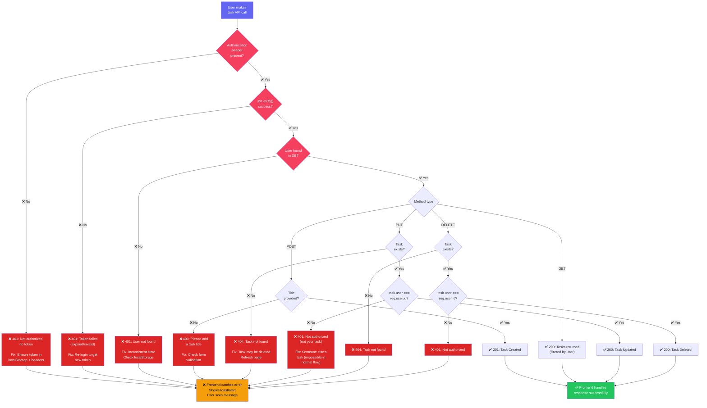

---

## 12. Testing Checklist — Before Marking Feature 2 Complete

> ✅ Verify each feature works end-to-end

### Backend Testing (Postman)
- [ ] **Auth Still Works**: POST /api/auth/login → get JWT token
- [ ] **No Token → 401**: GET /api/tasks without Authorization header → 401 error
- [ ] **Create Task**: POST /api/tasks with `{"title": "Test"}` + Bearer token → 201 + task object
- [ ] **Read Tasks**: GET /api/tasks + Bearer token → 200 + array of YOUR tasks only
- [ ] **Update Task**: PUT /api/tasks/:id with `{"completed": true}` → 200 + updated task
- [ ] **Delete Task**: DELETE /api/tasks/:id → 200 + { id }
- [ ] **Ownership Check**: Create task as User A, try to delete as User B → 401 error

### Frontend Testing (Browser)
- [ ] **Unauthenticated → Redirect**: Open `/dashboard` without login → redirect to `/login`
- [ ] **Login Works**: Sign in → redirect to `/dashboard`
- [ ] **Task Form Renders**: Dashboard shows input + "Add Task" button
- [ ] **Create Task**: Type title + click button → task appears in list
- [ ] **Toggle Task**: Click checkbox → task marked as completed (visual)
- [ ] **Delete Task**: Click delete button → task removed from list
- [ ] **Logout Works**: Click logout → redirect to `/login` + localStorage cleared

---

## 📊 Architecture Summary — Feature 2 Complete State

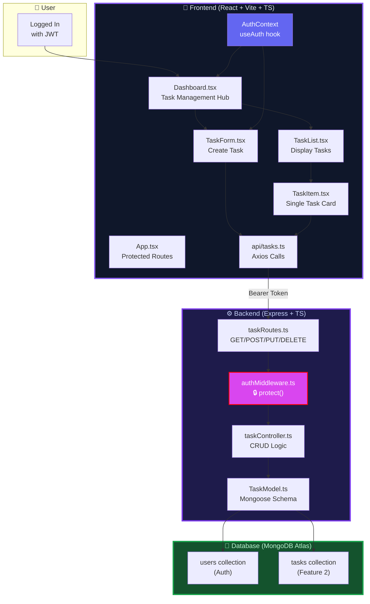

---

## 🎯 Next Steps After Feature 2

Once Feature 2 (Task CRUD) is complete:
1. **Polish UI** — Add animations, better styling (grid 8-point design)
2. **Error Handling** — Toast notifications for errors
3. **Loading States** — Spinners while fetching
4. **Validation** — Input validation on frontend
5. **Optimistic Updates** — Update UI before API response
6. **Feature 3** — Task Filtering (All/Active/Completed)
7. **Feature 4** — Task Editing (inline or modal)
8. **Feature 5** — Due Dates & Priority
9. **Deployment** — Push to production (Vercel + Heroku)
